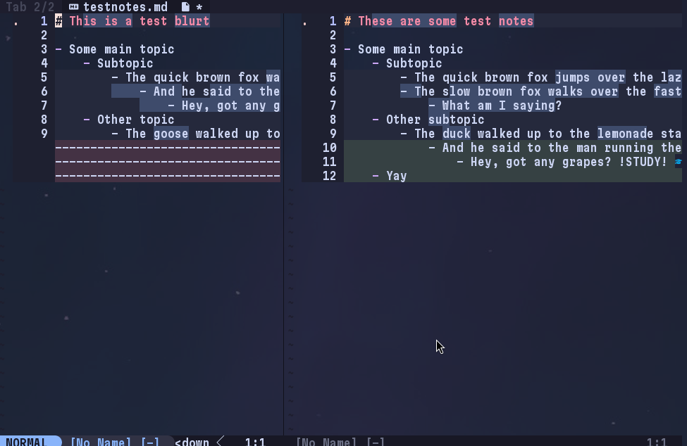

# studytools.blurt



**Blurt** adds functionality to help you use the *blurting* study method in Neovim

## Usage

There is **one command** that you need to know, that being:

```vim
:StudytoolsBlurt
```

This will open a new buffer. Remove the sample text, and start blurting.  
When you are done, write the buffer, which will bring up a **diff** showing what you missed!

## Setup

To set up, simply add the following to your `init.lua`, or wherever you configure your plugins:

```lua
require("studytools.blurt").setup()
```
